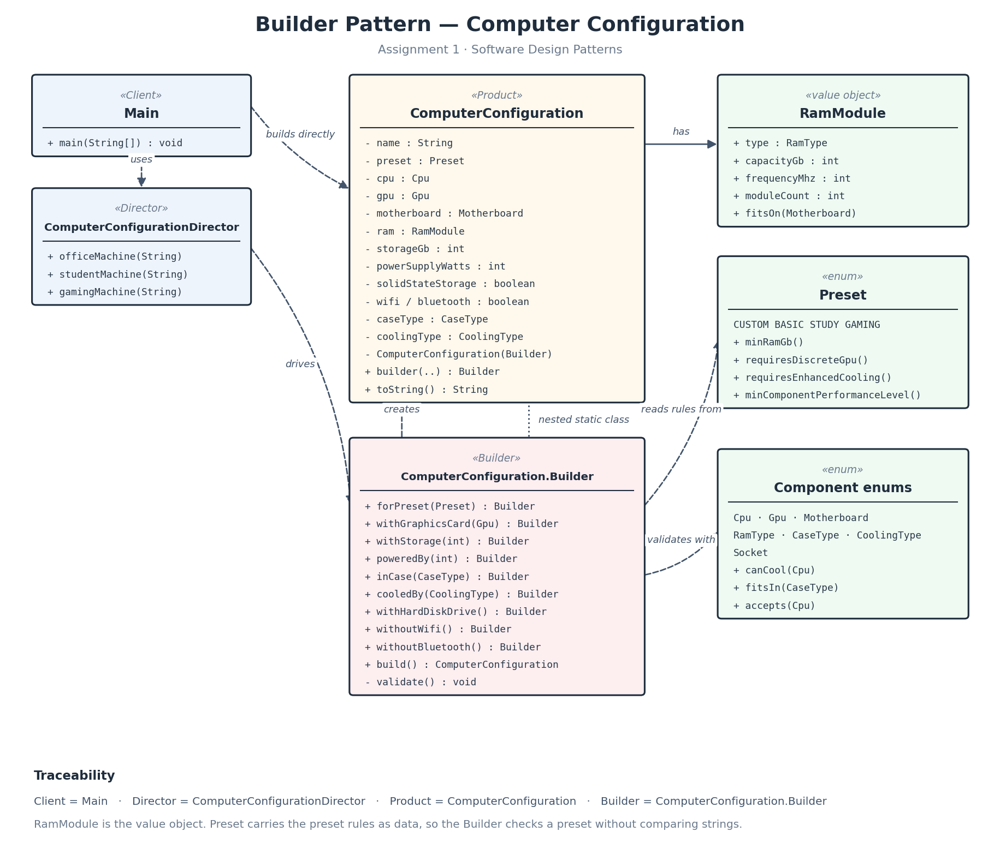

# Assignment 1 — Builder Pattern: Design Under Changing Requirements

**Course:** Software Design Patterns
**Pattern:** Builder
**Domain:** Computer Configuration
**Repository:** `<paste your GitHub URL here>`

---

## 1. Problem description

A configurator has to assemble a computer out of parts that are not independent
of each other. A processor only fits a matching socket; memory only runs on a
board that supports its generation and frequency; a cooler only works if it can
dissipate the heat the processor produces *and* physically fits the case; a
graphics card only works if the power supply can feed it.

So the object being constructed is not just "an object with many fields". It is
an object whose fields constrain one another. Two things follow:

1. construction has many parameters, most of them optional with sensible
   defaults;
2. a partially assembled configuration is meaningless — the machine can only be
   judged as a whole, once every part is known.

That combination is exactly what the Builder pattern is for: collect the parts
step by step, decide at one single point whether the result is a legal machine,
and only then hand out an immutable Product.

## 2. Individual variant

| | |
|---|---|
| **Domain** | Computer Configuration |
| **Constraint** | The `GAMING` preset raises the requirements of several otherwise unrelated fields at once: at least 16 GB RAM, a discrete GPU, an enhanced cooling solution, and a minimum performance level for *both* CPU and GPU. A configuration that is perfectly legal as a `CUSTOM` machine can therefore still be rejected as a `GAMING` machine. |
| **Required preset** | `GAMING`, plus `BASIC` and `STUDY` |

The constraint is deliberately *cross-field and preset-dependent*: it cannot be
checked by looking at any single property, and the same property values are
valid or invalid depending on another property.

## 3. Part A — the initial constructor-based solution

Kept in the repository as `legacy/LegacyComputerConfiguration.java`
(commit *"Add constructor-based configuration to demonstrate the
telescoping-constructor problem"*). It offers three overloaded constructors, the
largest taking sixteen parameters:

```java
LegacyComputerConfiguration gamingPc = new LegacyComputerConfiguration(
        "Gaming PC", "GAMING", Cpu.RYZEN5, Gpu.RTX3060, Motherboard.B550,
        RamType.DDR4, 32, 3600, 2, 1000, 650, true, true, false,
        CaseType.MID_TOWER, CoolingType.TOWER_AIR);
```

### Three concrete design problems it causes

**1. The call site carries meaning that the compiler cannot check.**
`32, 3600, 2, 1000, 650` is five consecutive `int` arguments. Swapping the
capacity with the frequency, or the storage size with the wattage, compiles
cleanly and produces a wrong machine that fails nowhere. The same holds for
`true, true, false` — three `boolean` arguments in a row whose meaning exists
only in the parameter list of the constructor, which the reader of the call does
not see. The type system, which is the cheapest verification tool available,
is doing nothing here.

**2. Optional parameters force a combinatorial explosion of constructors.**
Ten optional properties cannot be expressed as overloads: the overloads either
collide on erasure (`(… int storageGb)` vs `(… int powerSupplyWatts)`) or grow
factorially. In practice a developer who wants to set only the cooling type has
to pass all sixteen arguments and repeat the defaults by hand — which means the
default values are now duplicated at every call site instead of living in one
place. Changing a default later silently misses everyone who copied it.

**3. There is no single point where the object can be checked.**
Each constructor either repeats the validation or delegates to the largest one,
and cross-field rules (socket, cooling capacity, power budget) have to be
written before any preset rule can be evaluated. `LegacyMain` shows the
consequence directly: it builds an "Impossible PC" — an AM4 processor on an
LGA1700 board, DDR5 memory on a DDR4 board, an RTX 4090 on a 300 W power
supply, liquid cooling in a case with no radiator mount — and the program prints
it happily. The object is constructed first and would have to be validated
somewhere else afterwards, which means an invalid instance exists, can be
passed around, and can be persisted.

## 4. Part B — the Builder solution

```java
ComputerConfiguration gamingPc = ComputerConfiguration
        .builder("Gaming PC", Cpu.RYZEN5, Motherboard.B550, RamModule.of(RamType.DDR4, 32, 3600))
        .forPreset(Preset.GAMING)
        .withGraphicsCard(Gpu.RTX3060)
        .withStorage(1000)
        .poweredBy(650)
        .inCase(CaseType.MID_TOWER)
        .cooledBy(CoolingType.TOWER_AIR)
        .build();
```

The four genuinely required properties — name, CPU, motherboard and memory —
are parameters of the builder factory method, so a configuration without them
cannot be started. Everything else is optional and has a documented default.
Every step method is named after the domain (`poweredBy`, `cooledBy`, `inCase`,
`withHardDiskDrive`, `withoutWifi`) rather than after the field it happens to
assign, and none of them takes a boolean flag.

### Participants

| Builder role | Class | Responsibility |
|---|---|---|
| **Product** | `ComputerConfiguration` | Immutable configuration. All fields `final`, constructor `private`, no setters. Instances can only come from the Builder, so an instance that exists is an instance that passed validation. |
| **Builder** | `ComputerConfiguration.Builder` | Holds the partially assembled state, supplies defaults, exposes the fluent domain API, runs all validation rules in `build()` and produces the Product. |
| **Client** | `Main` | Requests the three catalogue machines from the Director, assembles one custom machine directly, and demonstrates three rejected configurations. |
| **Director** | `ComputerConfigurationDirector` | Defines the construction recipe of each catalogue machine (`officeMachine`, `studentMachine`, `gamingMachine`) in exactly one place. |
| **Value object** | `RamModule` | Generation, capacity, frequency and module count as one self-validating unit. |
| Supporting types | `Preset`, `Cpu`, `Gpu`, `Motherboard`, `RamType`, `CaseType`, `CoolingType`, `Socket` | Carry the domain facts the rules are evaluated against. |

## 5. Part C — validation

`build()` never returns an invalid Product. It runs eight rule groups in a fixed
order, from cheapest and most local to most contextual, so that the first
message a user sees describes the most fundamental problem.

### Single-field rules

| # | Rule | Message |
|---|---|---|
| 1 | Name must not be null or blank | `Configuration name is required` |
| 2 | Storage ≥ 128 GB | `Storage must be at least 128 GB, but was 127` |
| 3 | Power supply ≥ 250 W | `Power supply must be at least 250 W, but was 200` |
| 4 | Required references must not be null | `CPU, motherboard and RAM are required` |
| 5 | RAM capacity ≥ 4 GB, frequency ≥ 800 MHz and within the generation limit, 1–4 modules — enforced by `RamModule`'s compact constructor | `RAM capacity must be at least 4 GB, but was 2` |

### Cross-field rules

| # | Dependency | Rule |
|---|---|---|
| 1 | CPU ↔ motherboard | `motherboard.accepts(cpu)` — the sockets must be identical |
| 2 | RAM ↔ motherboard | `ram.fitsOn(motherboard)` — generation, module count and frequency must all be supported |
| 3 | GPU ↔ power supply | `gpu.recommendedPsuWatts() <= powerSupplyWatts` |
| 4 | CPU ↔ cooling | `coolingType.canCool(cpu)` — the cooler must dissipate the CPU's TDP |
| 5 | Cooling ↔ case | `coolingType.fitsIn(caseType)` — cooler height, and a radiator mount for liquid cooling |
| 6 | CPU ↔ GPU | a level ≤ 2 CPU may not drive a level ≥ 4 GPU (bottleneck) |
| 7 | **Preset ↔ RAM, GPU, cooling, CPU** | the individual constraint: `GAMING` requires ≥ 16 GB, a discrete GPU, enhanced cooling and performance level ≥ 3 on both CPU and GPU |

### Why the validation lives in the Builder

Because a rule such as "GAMING needs enhanced cooling" cannot be evaluated
until every part is known. Validating in the Product's constructor would mean
the Product knows how to reject itself while already being half-constructed,
and validating in each setter would mean rejecting a configuration that is
merely *incomplete* rather than *wrong* — a builder that has a GPU but no power
supply yet is not invalid, it is unfinished. `build()` is the exact moment when
"unfinished" ends and "wrong" becomes a meaningful verdict.

## 6. Part D — preset configurations

The three presets are genuinely different machines, not the same machine with
different numbers:

| | `officeMachine` (BASIC) | `studentMachine` (STUDY) | `gamingMachine` (GAMING) |
|---|---|---|---|
| CPU | CELERON | I5 | RYZEN5 |
| Board | H610 | B660 | B550 |
| Memory | 8 GB DDR4-3200 | 16 GB DDR4-3200 | 32 GB DDR4-3600 |
| Graphics | integrated | integrated | RTX 3060 |
| Storage | 256 GB | 512 GB | 1000 GB |
| Power supply | 300 W | 450 W | 650 W |
| Case | mini tower | mid tower | mid tower |
| Cooling | stock air | tower air | tower air |
| Wireless | Wi-Fi only | Wi-Fi + Bluetooth | Wi-Fi + Bluetooth |

They differ in socket family, in graphics strategy, in chassis class and in
which preset rules apply to them, so each one exercises a different part of the
validation.

### Why a Director is justified here

The catalogue machines are not a client concern. A shop assistant asks for "a
student PC"; the knowledge of which processor and which board that means is
inventory knowledge, and it changes when the price list changes. Without a
Director, that knowledge would be copied into every client that needs a
standard machine, and updating the student configuration would mean finding all
of those copies. With a Director it is one method. The Builder stays
general-purpose, the Director stays a thin recipe book, and the two roles can
change independently.

## 7. Part E — Clean Code, before → after

### Case 1 — the construction call itself

**BEFORE** (`LegacyMain`, commit *"Add constructor-based configuration…"*):

```java
LegacyComputerConfiguration gamingPc = new LegacyComputerConfiguration(
        "Gaming PC", "GAMING", Cpu.RYZEN5, Gpu.RTX3060, Motherboard.B550,
        RamType.DDR4, 32, 3600, 2, 1000, 650, true, true, false,
        CaseType.MID_TOWER, CoolingType.TOWER_AIR);
```

**AFTER** (`Main`):

```java
ComputerConfiguration gamingPc = ComputerConfiguration
        .builder("Gaming PC", Cpu.RYZEN5, Motherboard.B550, RamModule.of(RamType.DDR4, 32, 3600))
        .forPreset(Preset.GAMING)
        .withGraphicsCard(Gpu.RTX3060)
        .withStorage(1000)
        .poweredBy(650)
        .cooledBy(CoolingType.TOWER_AIR)
        .build();
```

1. **What was wrong.** Sixteen positional arguments, of which five were bare
   `int` and three were bare `boolean`. The reader cannot tell what `3600` or
   the second `true` mean without opening another file, and the compiler cannot
   tell either.
2. **Principles applied.** *Minimize the number of arguments* — every step takes
   zero or one argument. *Avoid flag arguments* — `true, true, false` became
   `withHardDiskDrive()`, `withoutWifi()`, `withoutBluetooth()`, each of which
   says what it does. *Use intention-revealing names* — `poweredBy(650)` reads
   as a sentence where `650` did not.
3. **Why it is better.** Each argument is now adjacent to the name that explains
   it, so an argument cannot be silently transposed, and a reader of the call
   site no longer needs the constructor signature to understand the call.

### Case 2 — the validation method

**BEFORE** (commit *"Guarantee that the Builder cannot produce a physically
impossible configuration"*):

```java
private void validate() {
    if (name == null || name.isBlank()) { throw new IllegalArgumentException("Configuration name is required"); }
    if (storageGb < 128) { throw new IllegalArgumentException("Storage must be at least 128 GB, but was " + storageGb); }
    if (motherboard.socket() != cpu.socket()) { throw new IllegalArgumentException("CPU socket is incompatible with the motherboard"); }
    if (ram.type() != motherboard.supportedRamType()) { throw new IllegalArgumentException("RAM generation is incompatible with the motherboard"); }
    if (ram.moduleCount() > motherboard.memorySlots()) { throw new IllegalArgumentException("Too many memory modules for this motherboard"); }
    if (ram.frequencyMhz() > motherboard.maxMemoryFrequencyMhz()) { throw new IllegalArgumentException("RAM frequency exceeds what the motherboard supports"); }
    if (cpu.thermalDesignPowerWatts() > coolingType.maxCpuTdpWatts()) { throw new IllegalArgumentException("Cooling is insufficient for this CPU"); }
    // … twelve conditions in total
}
```

**AFTER** (commit *"Split the validation method into intention-revealing rule
checks"*):

```java
private void validate() {
    validateRequiredFields();
    validateNumericRanges();
    validateCpuAndMotherboard();
    validateMemory();
    validatePowerBudget();
    validateCoolingAndCase();
    validateComponentBalance();
    validatePresetRequirements();
}

private void validateMemory() {
    if (!ram.fitsOn(motherboard)) {
        throw new IllegalArgumentException(
                "Memory " + ram + " is not supported by " + motherboard + " (expects "
                        + motherboard.supportedRamType() + ", up to " + motherboard.memorySlots()
                        + " modules at " + motherboard.maxMemoryFrequencyMhz() + " MHz)");
    }
}
```

1. **What was wrong.** One function mixed twelve unrelated rules and two levels
   of abstraction: "is this string blank" sits next to "is this machine
   balanced". Three separate `if`s all answered one question — *does this memory
   fit this board?* — which meant a reader had to reassemble the concept from
   scattered lines.
2. **Principles applied.** *Small functions* and *one function, one
   responsibility* — each method now answers one question. *One level of
   abstraction per function* — `validate()` reads as the list of rule groups and
   nothing else. *DRY* — the three memory conditions collapsed into
   `ram.fitsOn(motherboard)`, which the tests can also call directly.
3. **Why it is better.** Adding a rule now means adding or editing one small
   method instead of appending to a growing one, and the order of the rule
   groups — which decides which message the user sees first — is visible at a
   glance in `validate()`.

### Case 3 — preset rules and error messages

**BEFORE** (the string-keyed version this project started from):

```java
private void validatePresetRules() {
    if ("GAMING".equalsIgnoreCase(preset)) {
        if (ramGb < 16) throw new IllegalArgumentException("Gaming requires at least 16 GB RAM");
        if (gpu == Gpu.INTEGRATED) throw new IllegalArgumentException("Gaming requires a dedicated GPU");
        if (!coolingSystem) throw new IllegalArgumentException("Gaming requires an additional cooling system");
    }
    if ("STUDY".equalsIgnoreCase(preset) && ramGb < 12)
        throw new IllegalArgumentException("Study preset requires at least 12 GB RAM");
}
```

**AFTER** (`Preset` enum + `validatePresetRequirements()`):

```java
public enum Preset {
    CUSTOM(4, false, false, 1),
    BASIC(4, false, false, 1),
    STUDY(12, false, false, 1),
    GAMING(16, true, true, 3);
    // …
}

private void validatePresetRequirements() {
    if (ram.capacityGb() < preset.minRamGb()) {
        throw new IllegalArgumentException(
                preset + " requires at least " + preset.minRamGb() + " GB of RAM, but only "
                        + ram.capacityGb() + " GB was configured");
    }
    if (preset.requiresEnhancedCooling() && !coolingType.isEnhanced()) {
        throw new IllegalArgumentException(
                preset + " requires an enhanced cooling solution, but " + coolingType + " was configured");
    }
    // …
}
```

1. **What was wrong.** The preset was a `String`, so `"GAMMING"` would silently
   disable every gaming rule with no compiler error and no test failure. The
   rules were an `if`-chain that had to be extended by copy-paste for every new
   preset, and the messages stated the rule without stating what the user had
   actually configured.
2. **Principles applied.** *Clear error handling* — every message now names both
   the requirement and the offending value. *DRY* — one rule body serves all
   presets instead of one branch per preset. *Avoid magic values* — the string
   literals became enum constants the compiler checks.
3. **Why it is better.** Adding a preset is now adding one enum constant with
   four numbers; no validation code changes at all. And a failing build tells
   the user *"GAMING requires an enhanced cooling solution, but STOCK_AIR was
   configured"* instead of a sentence they still have to interpret.

## 8. Part F — design decisions

### Decision 1 — validation belongs to the Builder, not to the Product

- **Decision.** All rules run in `Builder.build()`. The Product's constructor
  only copies fields.
- **Alternative.** Validate inside the Product's private constructor, which
  would guarantee the invariant even if a second builder were ever added.
- **Reasoning for rejecting it.** The cross-field and preset rules are rules
  about *the act of configuring*, not about the finished machine: they need the
  preset the user selected and the defaults the Builder supplied. Putting them
  in the Product would make the Product depend on configuration policy, so a
  policy change ("GAMING now needs 32 GB") would edit the Product class. With a
  single private constructor reachable only from the Builder, the invariant is
  already guaranteed structurally, so the alternative buys protection against a
  risk that the design does not have.

### Decision 2 — derive `hasDedicatedGpu()` instead of storing it

- **Decision.** There is no `dedicatedGpu` field. `Gpu.isDiscrete()` answers the
  question, because `Gpu.INTEGRATED` already encodes "no discrete card".
- **Alternative.** Keep a `boolean dedicatedGpu` next to the `Gpu`, as the first
  version of this project did, and validate that the two agree.
- **Reasoning for rejecting it.** Two fields describing one fact can disagree,
  so the design had to add a rule whose only purpose was to forbid the
  disagreement — and that rule made the perfectly reasonable call
  `builder(name, cpu).withGraphicsCard(RTX3060).build()` throw until the user
  also remembered to flip the flag. Removing the field removed one field, two
  validation rules and one whole class of user error at once. Derived state
  cannot drift.

### Decision 3 — the Builder stays mutable and reusable

- **Decision.** The Builder keeps its state after `build()`, so it can be
  adjusted and built again. Independence is guaranteed on the other side: the
  Product copies every value into `final` fields at construction.
- **Alternative.** A one-shot Builder that marks itself consumed and throws on a
  second `build()`.
- **Reasoning for rejecting it.** Reuse is the natural way to configure a batch
  of near-identical machines (a lab of twenty student PCs differing only in
  name), and since the Product is immutable and holds no reference back to the
  Builder, reuse is already safe. A one-shot Builder would prevent a legitimate
  use case in order to protect against aliasing that cannot occur here. The
  guarantee is pinned down by the `BuilderReuse` tests rather than left implicit.

### Decision 4 — memory is a value object, not four loose fields

- **Decision.** `RamModule` is a `record` holding type, capacity, frequency and
  module count, validating itself in its compact constructor.
- **Alternative.** Four separate builder methods (`ramType`, `ramGb`,
  `ramFrequency`, `ramSlots`), as in the first version.
- **Reasoning for rejecting it.** Those four values are only meaningful
  together — a frequency without a generation cannot be checked at all — yet as
  separate optional fields each could be set independently and a half-specified
  memory configuration was representable. As a value object the memory is
  either fully specified or does not exist, `fitsOn(Motherboard)` gives the
  compatibility rule one obvious home, and the Builder lost three step methods.

## 9. Part G — UML class diagram



Source: [`docs/builder-uml.puml`](docs/builder-uml.puml).

| Builder role | Your class | Responsibility |
|---|---|---|
| Product | `ComputerConfiguration` | Immutable, fully validated configuration; private constructor; no setters |
| Builder | `ComputerConfiguration.Builder` | Partial state, defaults, fluent domain API, validation, `build()` |
| Client | `Main` | Uses the Director for presets, the Builder directly for a custom machine, and shows rejections |
| Director | `ComputerConfigurationDirector` | Defines the three catalogue configurations once |
| Value object | `RamModule` | Self-validating memory specification, `fitsOn(Motherboard)` |
| Supporting enums | `Preset`, `Cpu`, `Gpu`, `Motherboard`, `RamType`, `CaseType`, `CoolingType`, `Socket` | Domain facts and small behaviours (`canCool`, `fitsIn`, `accepts`) the rules use |

## 10. Part H — testing

17 tests in `ComputerConfigurationTest`, grouped with `@Nested` so the groups
map directly onto the assignment:

| Group | Tests | What is verified |
|---|---|---|
| Valid construction | 4 | the three presets build and carry the properties the preset promises; optional properties fall back to the documented defaults |
| Invalid construction | 6 | blank name, socket mismatch, wrong memory generation, insufficient power supply, CPU/GPU bottleneck, invalid memory value object |
| Boundary cases | 3 | minimum storage accepted / one GB below rejected; memory at exactly the board's frequency limit accepted / one step above rejected; cooler at exactly the CPU's TDP accepted / above it rejected |
| Individual constraint | 3 | `GAMING` rejects a stock cooler, 12 GB of RAM and an integrated GPU — each time proving first that the *same* configuration is accepted under another preset |
| Builder reuse | 2 | a product built earlier is unaffected by later builder changes; the Director returns independent products |

Two properties of the suite are worth pointing out during the defense.

**Every negative test asserts the rejection message, not just the exception
type.** The first version of this project had a test named
`rejectsGamingWithoutCooling` that passed for the wrong reason: the
configuration it used failed the *CPU cooling capacity* rule before the preset
rule was ever reached, so the rule the test was named after was not covered at
all. Asserting the message makes that failure mode impossible.

**Each individual-constraint test is a pair.** It first asserts that a
configuration is accepted under a permissive preset, then asserts that the very
same configuration is rejected under `GAMING`. That is what makes it a test of
the *constraint* rather than a test of some unrelated rule that happens to fire.

## 11. Sample program output

```
== Preset configurations ==
ComputerConfiguration{Reception PC, preset=BASIC, cpu=CELERON, gpu=INTEGRATED, board=H610, ram=8GB DDR4-3200 (2 modules), storage=256GB, psu=300W, case=MINI_TOWER, cooling=STOCK_AIR}
ComputerConfiguration{Study PC, preset=STUDY, cpu=I5, gpu=INTEGRATED, board=B660, ram=16GB DDR4-3200 (2 modules), storage=512GB, psu=450W, case=MID_TOWER, cooling=TOWER_AIR}
ComputerConfiguration{Gaming PC, preset=GAMING, cpu=RYZEN5, gpu=RTX3060, board=B550, ram=32GB DDR4-3600 (2 modules), storage=1000GB, psu=650W, case=MID_TOWER, cooling=TOWER_AIR} 🍌

== Custom configuration ==
ComputerConfiguration{Render Workstation, preset=CUSTOM, cpu=I9, gpu=RTX4090, board=B760_DDR5, ram=64GB DDR5-6000 (4 modules), storage=4000GB, psu=1000W, case=FULL_TOWER, cooling=AIO_LIQUID}

== Rejected configurations ==
Socket mismatch: RYZEN5 uses socket AM4, but H610 provides socket LGA1700
Weak power supply: RTX4070 needs at least 650 W, but the configured power supply delivers 400 W
Preset rule: GAMING requires an enhanced cooling solution, but STOCK_AIR was configured
```

## 12. Git development history

| Commit | Content |
|---|---|
| 1 | Model the computer-configuration domain as enums and a RamModule value object |
| 2 | Add constructor-based configuration to demonstrate the telescoping-constructor problem *(Part A)* |
| 3 | Replace telescoping constructors with a fluent Builder and an immutable product *(Part B)* |
| 4 | Guarantee that the Builder cannot produce a physically impossible configuration *(Part C)* |
| 5 | Introduce Preset enum and a Director so catalogue machines are defined once *(Part D)* |
| 6 | Split the validation method into intention-revealing rule checks *(Part E)* |
| 7 | Cover every validation rule with tests that assert the rejection reason *(Part H)* |
| 8 | Add UML class diagram with the Builder role traceability *(Part G)* |
| 9 | Add README and report |

## 13. Repository

`<paste your GitHub URL here>`
